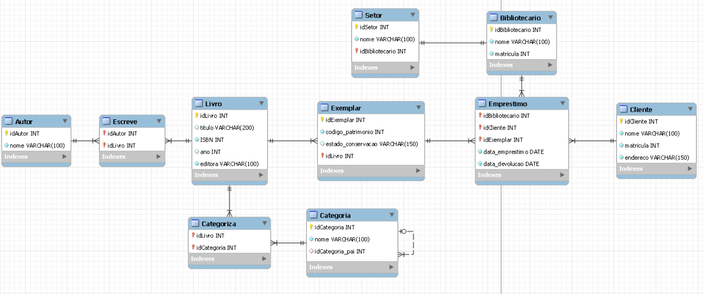
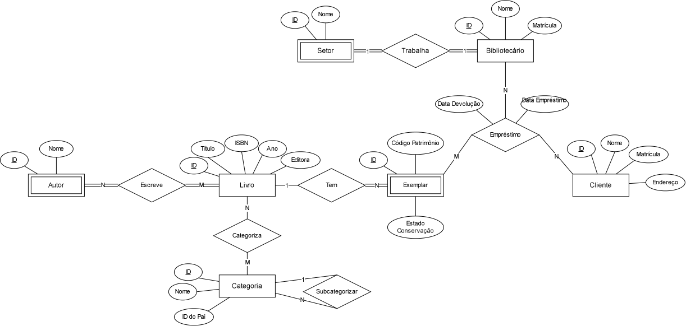

# **Biblioteca de Alexandria**

Projeto acadêmico da disciplina de Banco de Dados 1, com objetivo de modelar e implementar o banco de dados de uma biblioteca, contemplando entidades, relacionamentos e regras de negócio básicas de um sistema de empréstimos.
- Grupo: Gabriel Costa Aparecida, Marcelo Rodrigues Rosa Paschoal, Tiago Da Silva Machado.

## Descrição:

O sistema permite gerenciar livros, exemplares físicos, clientes, bibliotecários, categorias, autores e empréstimos, cobrindo os principais tipos de relacionamento entre entidades (1:1, 1:N, N:N, recursivo e associativo/ternário).

## Entidades:

| Nome | Descrição | Atributos |
|------|-----------|-----------|
| **Livro** | informações gerais da obra | id_livro, titulo, ISBN, ano, editora |
| **Exemplar** | cópia física de um livro | id_exemplar, id_livro, codigo_patrimonio, estado_conservacao |
| **Autor** | autor(es) das obras | id_autor, nome |
| **Cliente** | usuário que realiza empréstimos | id_cliente, nome, matricula, endereco |
| **Bibliotecário** | funcionário responsável pelo atendimento | id_bibliotecario, nome, matricula_funcional, id_setor |
| **Setor** | separações organizacional da biblioteca | id_setor, nome |
| **Categoria** | classificação temática dos livros | id_categoria, nome, id_categoria_pai |
| **Empréstimo** | registro de retirada/devolução | id_emprestimo, id_cliente, id_exemplar, id_bibliotecario, data_emprestimo, data_devolucao |

## Relacionamentos:
 
| Tipo | Entidades envolvidas | Descrição |
|------|----------------------|-----------|
| 1:1 | Bibliotecário - Setor | Bibliotecário trabalha em um setor e um setor é trabalhado por um bibliotecário |
| 1:N | Livro - Exemplar | Existem vários exemplares de um livro, porém um exemplar só pode representar um livro |
| N:N | Livro - Categoria | Um livro pode ter várias categorias e uma categoria pode pertencer vários livros |
| N:N | Livro - Autor | Um livro precisa de pelo menos um autor e um autor precisa ter escrito pelo menos um livro |
| Recursivo | Categoria - Categoria (subcategorias) | Uma subcategoria pode estar dentro de uma categoria Ex.: ficção-científica está dentro de ficção |
| Associativo | Empréstimo (Cliente + Exemplar + Bibliotecário) | Um cliente pegou emprestado um exemplar com um bibliotecário |

## Requisitos atendidos
 
- [x] Mínimo de 5 entidades
- [x] Relacionamento 1:1
- [x] Relacionamento 1:N
- [x] Relacionamento N:N
- [x] Relacionamento recursivo
- [x] Relacionamento associativo/ternário

## Diagrama Entidade de Relacionamento (DER)

### Chen:
